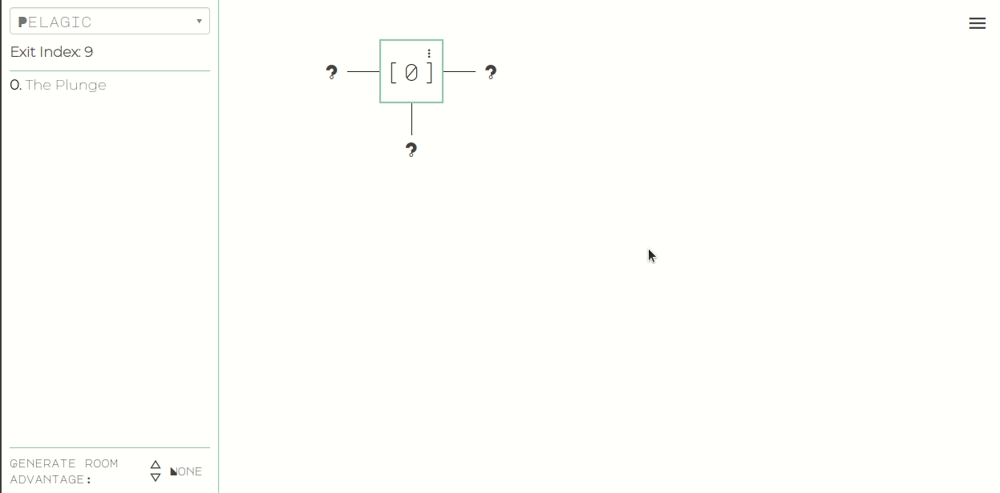
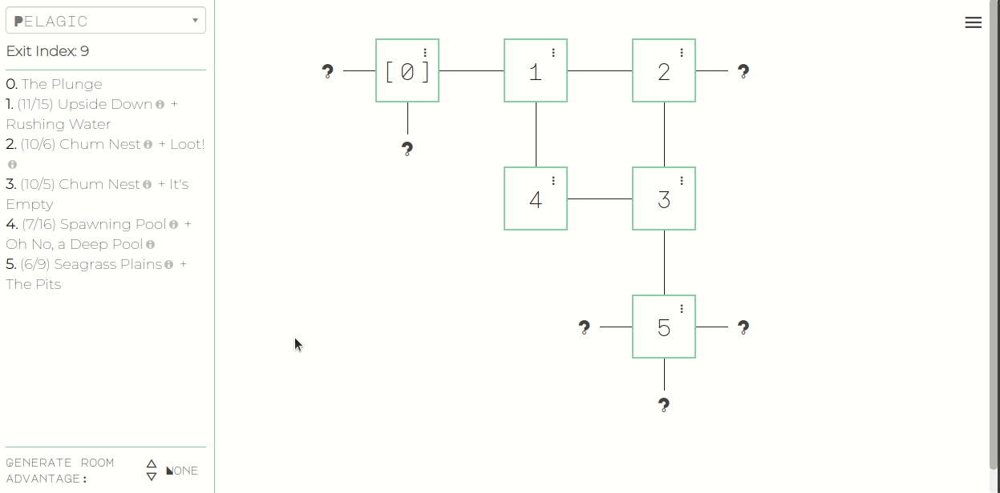
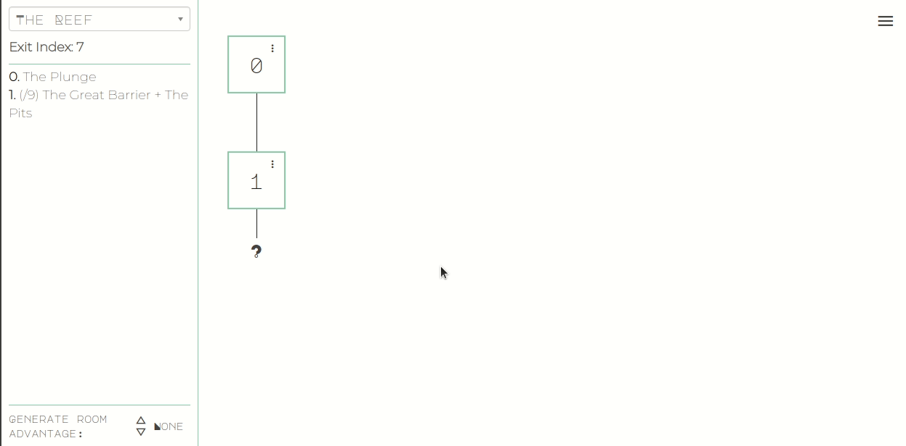
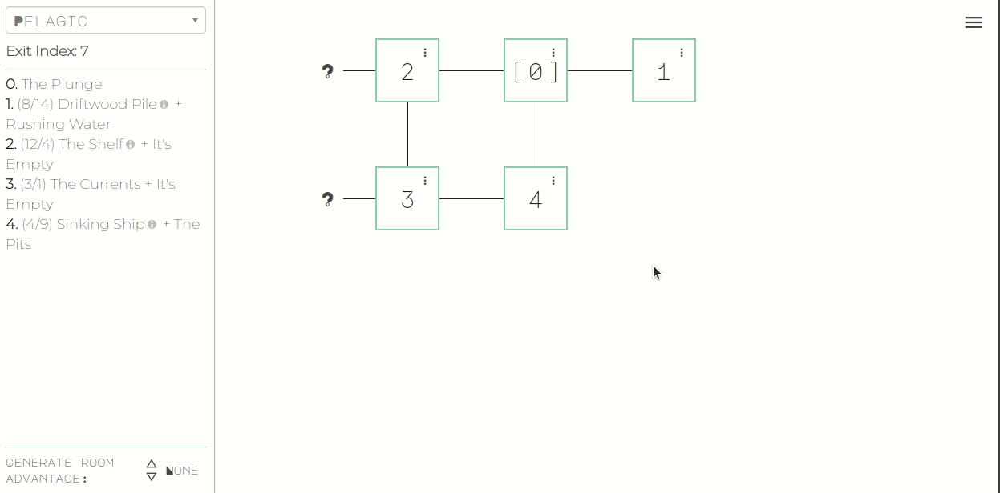
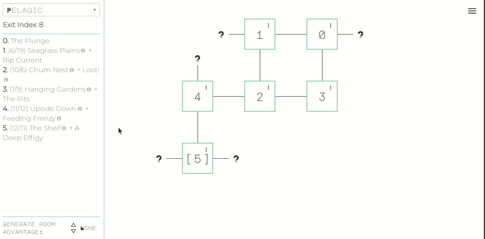
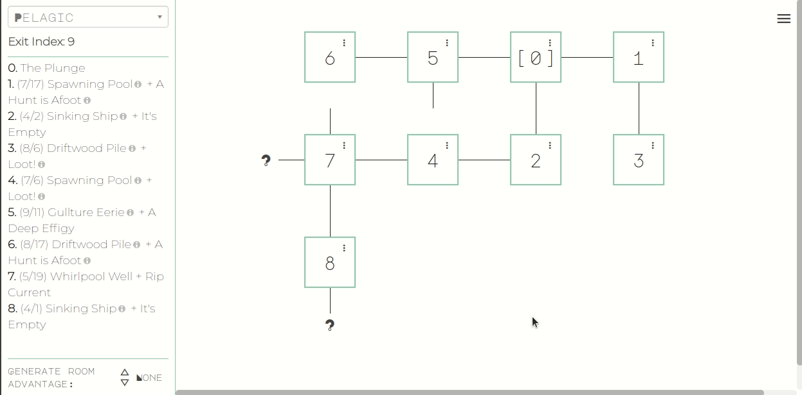
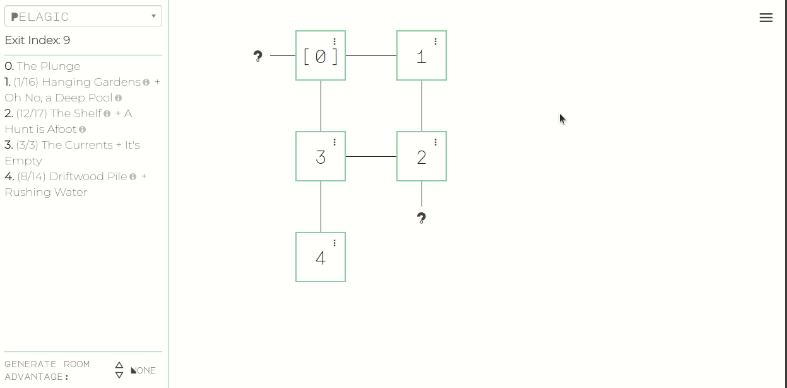

# Shifting Sands

A map generator for [A Rasp of Sand](https://www.davecox.design/a-rasp-of-sand) by [Dave Cox](https://twitter.com/DastrdlyDave). 

Check it out [here](https://brstf.github.io/shifting-sands/).
Also contains a [new character attribute generator](https://brstf.github.io/shifting-sands/new-character) for players.

## Usage

### Generate Map



To generate rooms, click on the question mark in the direction the party is travelling.

The party's current location is marked with brackets, you can update their location by clicking on a room.

#### Generate Room Advantage



Some abilities grant advantage or disadvantage on room generation. To add instances of advantage/disadvantage to the generation roll, use the controls in the bottom left. The next room generated will use that advatntage, then reset it back to 0.

### Room Options

The triple dot in the upper-right corner of the room tile contains a menu with options for the room:

- *Regenerate* - Regenerates the current room for different situations/parameters. Especially useful if a dead-end is generated before the exit:



- *Encounter* - Generates an encounter for the room. Takes the rooms _Danger_ into account



- *Force Shop* - Replaces the room's situation with a shop for the Merchant's *Connections* ability
- *Force Shrine* - Replaces the room's situation with a shrine for the Priest's *Guidance* ability
- *Room Notes* - Expands a text box for general notes, like what rooms the Elevator or the Shelf link to, creatures in the room, items left behind, etc.



- *Rotate* - Rotates the room clockwise or counter-clockwise. Used for the _Leviathan's Wheel_



### Menu

Contains global menu options:

- *Loot!* - Generates a random piece of loot
- *Slugs* - Shows the current mapping of slug color to effect
- *Generate…* - Opens a dialog to generate any item off of any table in case something is needed outside of the automatic generation



- *History* - Shows a log of all events for reference
- *New Character* - Navigates to the [new character page](#new-character-attributes)
- *Reset All* - Resets all rooms and history for a new generation. From the confirmation dialog you can choose to not reset the slug table for the Academic's *Seeing the Patterns* ability
- *View Source* - Brings you here!

### New Character Attributes

A separate page that generates all of the attributes of a new character except stats (because those depend on stats from the previous character, I might add something like that in the future though)

## Dev - Getting Started

The following is from the re-frame template generation, but should be useful if you want to build your own version or add features.

### Project Overview

* Architecture:
[Single Page Application (SPA)](https://en.wikipedia.org/wiki/Single-page_application)
* Languages
  - Front end ([re-frame](https://github.com/day8/re-frame)): [ClojureScript](https://clojurescript.org/) (CLJS)
* Dependencies
  - UI framework: [re-frame](https://github.com/day8/re-frame)
  ([docs](https://github.com/day8/re-frame/blob/master/docs/README.md),
  [FAQs](https://github.com/day8/re-frame/blob/master/docs/FAQs/README.md)) ->
  [Reagent](https://github.com/reagent-project/reagent) ->
  [React](https://github.com/facebook/react)
  - UI components: [re-com](https://github.com/day8/re-com)
  - Keyboard event handler: [re-pressed](https://github.com/gadfly361/re-pressed)
* Build tools
  - Project task & dependency management: [Leiningen](https://github.com/technomancy/leiningen)
  - CLJS compilation, REPL, & hot reload: [`shadow-cljs`](https://github.com/thheller/shadow-cljs)
* Development tools
  - Debugging: [CLJS DevTools](https://github.com/binaryage/cljs-devtools),
  [`re-frame-10x`](https://github.com/day8/re-frame-10x)

#### Directory structure

* [`/`](/../../): project config files
* [`dev/`](dev/): source files compiled only with the [dev](#running-the-app) profile
  - [`cljs/user.cljs`](dev/cljs/user.cljs): symbols for use during development in the
[ClojureScript REPL](#connecting-to-the-browser-repl-from-a-terminal)
* [`resources/public/`](resources/public/): SPA root directory;
[dev](#running-the-app) / [prod](#production) profile depends on the most recent build
  - [`vendor/`](resources/public/vendor/): UI component CSS, fonts, and images
  ([re-com](https://github.com/day8/re-com))
  - [`index.html`](resources/public/index.html): SPA home page
    - Dynamic SPA content rendered in the following `div`:
        ```html
        <div id="app"></div>
        ```
    - Customizable; add headers, footers, links to other scripts and styles, etc.
  - Generated directories and files
    - Created on build with either the [dev](#running-the-app) or [prod](#production) profile
    - Deleted on `lein clean` (run by all `lein` aliases before building)
    - `js/compiled/`: compiled CLJS (`shadow-cljs`)
      - Not tracked in source control; see [`.gitignore`](.gitignore)
* [`src/cljs/shifting_sands/`](src/cljs/shifting_sands/): SPA source files (ClojureScript,
[re-frame](https://github.com/Day8/re-frame))
  - [`core.cljs`](src/cljs/shifting_sands/core.cljs): contains the SPA entry point, `init`

### Editor/IDE

Use your preferred editor or IDE that supports Clojure/ClojureScript development. See
[Clojure tools](https://clojure.org/community/resources#_clojure_tools) for some popular options.

### Environment Setup

1. Install [JDK 8 or later](https://openjdk.java.net/install/) (Java Development Kit)
2. Install [Leiningen](https://leiningen.org/#install) (Clojure/ClojureScript project task &
dependency management)
3. Install [Node.js](https://nodejs.org/) (JavaScript runtime environment) which should include
   [NPM](https://docs.npmjs.com/cli/npm) or if your Node.js installation does not include NPM also install it.
7. Clone this repo and open a terminal in the `shifting-sands` project root directory
8. (Optional) Download project dependencies:
    ```sh
    lein deps
    ```

### Browser Setup

Browser caching should be disabled when developer tools are open to prevent interference with
[`shadow-cljs`](https://github.com/thheller/shadow-cljs) hot reloading.

Custom formatters must be enabled in the browser before
[CLJS DevTools](https://github.com/binaryage/cljs-devtools) can display ClojureScript data in the
console in a more readable way.

#### Chrome/Chromium

1. Open [DevTools](https://developers.google.com/web/tools/chrome-devtools/) (Linux/Windows: `F12`
or `Ctrl-Shift-I`; macOS: `⌘-Option-I`)
2. Open DevTools Settings (Linux/Windows: `?` or `F1`; macOS: `?` or `Fn+F1`)
3. Select `Preferences` in the navigation menu on the left, if it is not already selected
4. Under the `Network` heading, enable the `Disable cache (while DevTools is open)` option
5. Under the `Console` heading, enable the `Enable custom formatters` option

#### Firefox

1. Open [Developer Tools](https://developer.mozilla.org/en-US/docs/Tools) (Linux/Windows: `F12` or
`Ctrl-Shift-I`; macOS: `⌘-Option-I`)
2. Open [Developer Tools Settings](https://developer.mozilla.org/en-US/docs/Tools/Settings)
(Linux/macOS/Windows: `F1`)
3. Under the `Advanced settings` heading, enable the `Disable HTTP Cache (when toolbox is open)`
option

Unfortunately, Firefox does not yet support custom formatters in their devtools. For updates, follow
the enhancement request in their bug tracker:
[1262914 - Add support for Custom Formatters in devtools](https://bugzilla.mozilla.org/show_bug.cgi?id=1262914).

## Development

### Running the App

Start a temporary local web server, build the app with the `dev` profile, and serve the app with
hot reload:

```sh
lein dev
```

Please be patient; it may take over 20 seconds to see any output, and over 40 seconds to complete.

When `[:app] Build completed` appears in the output, browse to
[http://localhost:8280/](http://localhost:8280/).

[`shadow-cljs`](https://github.com/thheller/shadow-cljs) will automatically push ClojureScript code
changes to your browser on save. To prevent a few common issues, see
[Hot Reload in ClojureScript: Things to avoid](https://code.thheller.com/blog/shadow-cljs/2019/08/25/hot-reload-in-clojurescript.html#things-to-avoid).

Opening the app in your browser starts a
[ClojureScript browser REPL](https://clojurescript.org/reference/repl#using-the-browser-as-an-evaluation-environment),
to which you may now connect.

#### Connecting to the browser REPL from your editor

See
[Shadow CLJS User's Guide: Editor Integration](https://shadow-cljs.github.io/docs/UsersGuide.html#_editor_integration).
Note that `lein dev` runs `shadow-cljs watch` for you, and that this project's running build id is
`app`, or the keyword `:app` in a Clojure context.

Alternatively, search the web for info on connecting to a `shadow-cljs` ClojureScript browser REPL
from your editor and configuration.

For example, in Vim / Neovim with `fireplace.vim`
1. Open a `.cljs` file in the project to activate `fireplace.vim`
2. In normal mode, execute the `Piggieback` command with this project's running build id, `:app`:
    ```vim
    :Piggieback :app
    ```

#### Connecting to the browser REPL from a terminal

1. Connect to the `shadow-cljs` nREPL:
    ```sh
    lein repl :connect localhost:8777
    ```
    The REPL prompt, `shadow.user=>`, indicates that is a Clojure REPL, not ClojureScript.

2. In the REPL, switch the session to this project's running build id, `:app`:
    ```clj
    (shadow.cljs.devtools.api/nrepl-select :app)
    ```
    The REPL prompt changes to `cljs.user=>`, indicating that this is now a ClojureScript REPL.
3. See [`user.cljs`](dev/cljs/user.cljs) for symbols that are immediately accessible in the REPL
without needing to `require`.

### Running `shadow-cljs` Actions

See a list of [`shadow-cljs CLI`](https://shadow-cljs.github.io/docs/UsersGuide.html#_command_line)
actions:
```sh
lein run -m shadow.cljs.devtools.cli --help
```

Please be patient; it may take over 10 seconds to see any output. Also note that some actions shown
may not actually be supported, outputting "Unknown action." when run.

Run a shadow-cljs action on this project's build id (without the colon, just `app`):
```sh
lein run -m shadow.cljs.devtools.cli <action> app
```
### Debug Logging

The `debug?` variable in [`config.cljs`](src/cljs/shifting_sands/config.cljs) defaults to `true` in
[`dev`](#running-the-app) builds, and `false` in [`prod`](#production) builds.

Use `debug?` for logging or other tasks that should run only on `dev` builds:

```clj
(ns shifting-sands.example
  (:require [shifting-sands.config :as config])

(when config/debug?
  (println "This message will appear in the browser console only on dev builds."))
```

## Production

Build the app with the `prod` profile:

```sh
lein prod
```

Please be patient; it may take over 15 seconds to see any output, and over 30 seconds to complete.

The `resources/public/js/compiled` directory is created, containing the compiled `app.js` and
`manifest.edn` files.

The [`resources/public`](resources/public/) directory contains the complete, production web front
end of your app.

Always inspect the `resources/public/js/compiled` directory prior to deploying the app. Running any
`lein` alias in this project after `lein dev` will, at the very least, run `lein clean`, which
deletes this generated directory. Further, running `lein dev` will generate many, much larger
development versions of the files in this directory.
